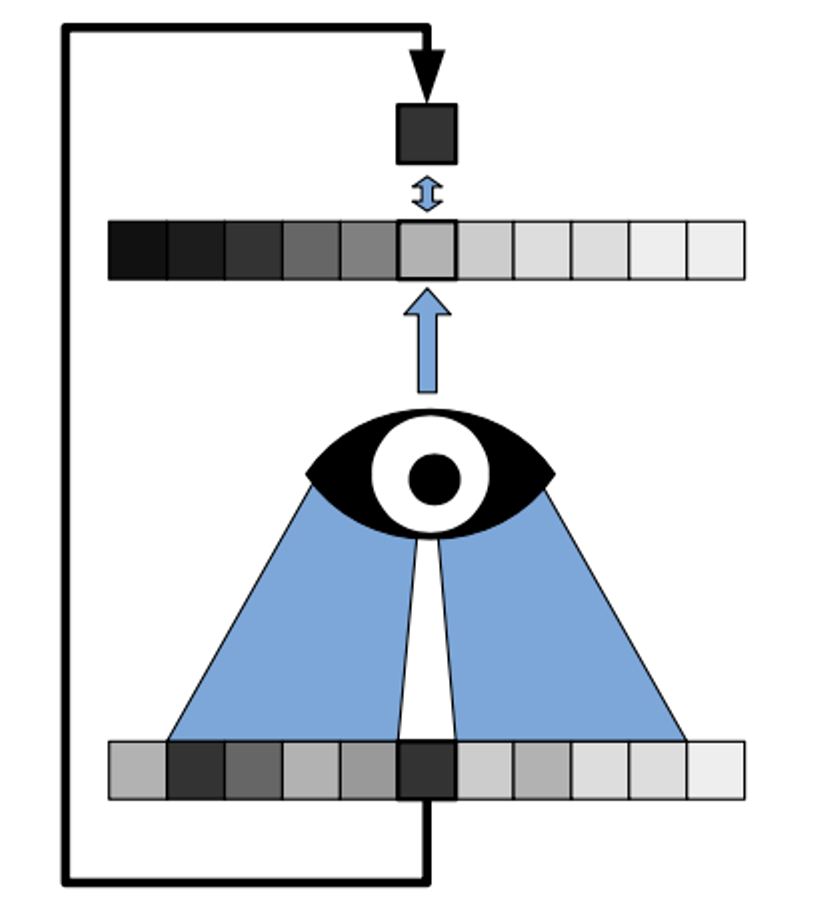

# Neural-PC

This is the code for training a neural network model on solving for electron beam lithography proximity error correction problems. The problem is broke down into 3 steps:

1. Denoising and binarization of SEM images
3. Training of network on mask and SEM images
4. Validation of effectiveness

## 1. Noise2Void (N2V) Implementation for SEM Image Denoising

### Introduction: The Need for Noise2Void in SEM Image Processing

In the field of semiconductor manufacturing and nanotechnology, proximity error correction is a critical process that ensures the accuracy of electron beam lithography. This correction relies heavily on high-quality Scanning Electron Microscope (SEM) images for precise contour extraction. However, we face a significant challenge:

1. **Noisy SEM Images**: SEM images inherently contain noise due to various factors such as electron scattering, detector sensitivity, and environmental interference.
2. **Need for Contour Extraction**: Accurate contour extraction from these images is crucial for effective proximity error correction.
3. **Lack of Ground Truth**: Unlike many image processing scenarios, we do not have access to "clean" or ground truth versions of our SEM images. Each image is a unique capture of a specific nanostructure.
4. **Pixel-wise Independent Noise**: Fortunately, the noise in SEM images is typically independent across pixels, a characteristic that can be leveraged for denoising.

Given these constraints, traditional supervised denoising methods, which require paired noisy and clean images for training, are not applicable. This is where Noise2Void (N2V) becomes invaluable.

Noise2Void is a self-supervised deep learning method that can denoise images without requiring clean reference data. It exploits the pixel-wise independence of noise and the spatial correlations within the true signal to effectively separate signal from noise.

By implementing N2V for our SEM image denoising, we aim to:

1. Improve the quality of SEM images without relying on ground truth data.
2. Enhance the accuracy of contour extraction from these images.
3. Ultimately, increase the precision of proximity error correction in electron beam lithography.

This implementation, therefore, addresses a critical need in our semiconductor manufacturing process, enabling us to push the boundaries of nanoscale fabrication accuracy.

### Mathematical Foundation and Working Principle

Noise2Void (N2V) is a self-supervised deep learning method for image denoising that operates on single noisy images, without requiring clean ground truth data. The key insight of N2V lies in its ability to learn the underlying signal distribution from noisy observations alone.

#### Mathematical Framework

Let $s$ be the true signal and $x$ be the observed noisy image. We model the noise as:

$x = s + n$

where $n$ is the noise, assumed to be pixel-wise independent given the signal.

The goal is to estimate $s$ given only $x$. N2V achieves this by leveraging the following key assumptions:

1. The signal $s$ has strong spatial correlations.
2. The noise $n$ is pixel-wise independent given the signal.

#### N2V Training Process

1. For each training sample, we select a target pixel $x_i$.
2. We create a blind-spot input by replacing $x_i$ with a random value $\tilde{x}_i$.
3. The network $f_\theta$ is trained to predict the original value $x_i$ given the surrounding context:

   $\hat{x}_i = f_\theta(\tilde{x}_{N(i)})$

   where $N(i)$ denotes the neighborhood of pixel $i$, excluding $i$ itself.
4. The loss is computed as:

   $L(\theta) = \mathbb{E}_i[(x_i - \hat{x}_i)^2]$

#### Why It Works

The key insight is that the network cannot simply learn the identity mapping, as the central pixel is masked. Instead, it must learn to infer the likely value of the central pixel based on its surroundings.

Given our assumptions:

- The network can learn to exploit spatial correlations in $s$ to make its predictions.
- It cannot learn to predict the noise $n_i$, as this is independent of the surrounding pixels.

Therefore, the network learns to predict:

$\hat{x}_i \approx \mathbb{E}[s_i | s_{N(i)}]$

This expectation is the optimal estimate of $s_i$ given the surrounding context, effectively denoising the image.

### Implementation Overview

This project implements the Noise2Void algorithm as described above. The key components are:

1. **N2VDataset**: Prepares training data by creating blind-spot inputs and corresponding targets.
2. **UNet**: A convolutional neural network architecture adapted for image denoising.
3. **Training Script**: Implements the N2V training procedure.
4. **Denoising Functions**: Apply the trained model to denoise new images.

### N2VDataset

The `N2VDataset` class performs the following operations:

1. **Data Loading**: Preprocesses image data from a specified folder.
2. **Patch Extraction**: Randomly extracts patches from the loaded images.
3. **Blind-Spot Creation**: Implements the N2V blind-spot mechanism using stratified sampling.
4. **Training Sample Generation**: Creates input-target pairs for training.

### UNet Architecture

The `UNet` class defines a U-Net architecture tailored for image denoising, with an encoder path, a decoder path, and skip connections.

### Usage

1. Prepare a folder with noisy images for training.
2. Run the training script to train the N2V model.
3. Use the trained model to denoise new images or folders of images.

### Advantages and Limitations

#### Advantages

- Requires only noisy images for training.
- Can be applied to various types of image noise.
- Useful in scenarios where obtaining clean images is challenging or impossible.

#### Limitations

- Performance may not match supervised methods trained on paired noisy-clean data.
- Assumes spatially uncorrelated noise.
- May struggle with very structured noise patterns.

This implementation provides a theoretically grounded and practical tool for image denoising in scenarios where traditional supervised learning is not feasible due to the lack of clean training data.

### Results: Denoising on SEM image

After training, we apply this network on the original SEM image. The denoised result clearly marks the boundaries while effectively suppressing noise.

| Original                          | Denoised                          |
| --------------------------------- | --------------------------------- |
|  |  |
